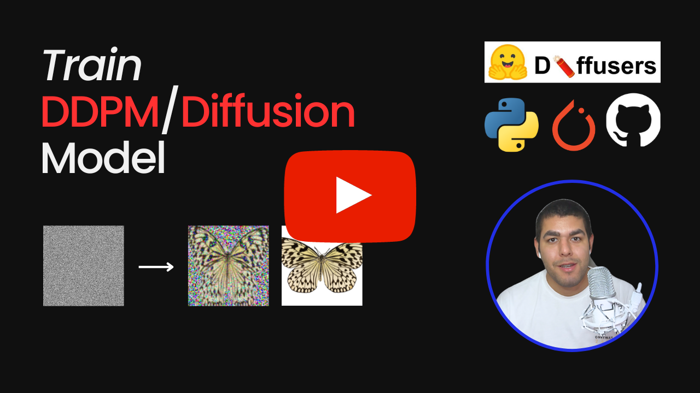

## Train DDPM/Diffusion Modelf for Image Generation

    
    

    

 

    
Liked our work? give us a ⭐!

This repository contains an easy-to-use and understand code to train [DDPM/Diffusion Model](https://arxiv.org/abs/2006.11239) for image generation. Sample training was made by using [smithsonian_butterflies_subset](https://huggingface.co/datasets/huggan/smithsonian_butterflies_subset).

Huggingface's [Train a diffusion model](https://huggingface.co/docs/diffusers/tutorials/basic_training) post has taken as a reference.

## YouTube Tutorial

    <a href="">Train DDPM/Diffusion Model for Image Generation - Diffusers, PyTorch</a>
     
     
    

## Contact 
You can contact me with this email address: uygarsci@gmail.com
